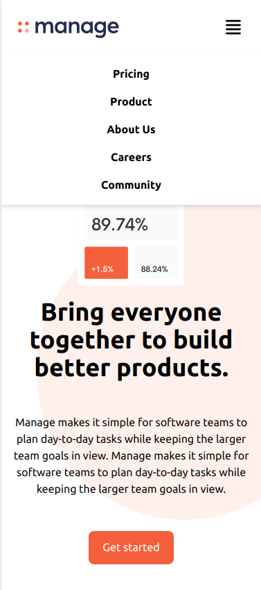

# Manage landing page solution using Tailwind CSS.

This is a solution to the [Manage landing page challenge on Frontend Mentor](https://www.frontendmentor.io/challenges/manage-landing-page-SLXqC6P5). Frontend Mentor challenges help you improve your coding skills by building realistic projects. 

## Table of contents

- [Overview](#overview)
  - [The challenge](#the-challenge)
  - [Screenshot](#screenshot)
  - [Links](#links)
  - [Built with](#built-with)
  - [What I learned](#what-i-learned)
- [Author](#author)

**Note: Delete this note and update the table of contents based on what sections you keep.**

## Overview

### The challenge

Users should be able to:

- View the optimal layout for the site depending on their device's screen size
- See hover states for all interactive elements on the page
- See all testimonials in a horizontal slider
- Build the page using Tailwind CSS

### Screenshot

Hero section of the page

### Links

- Live Site URL: [fm-mlp.pages.dev](https://fm-mlp.pages.dev/)

## My process

### Built with

- Semantic HTML5 markup
- Tailwind CSS
- Mobile-first workflow
- Flexbox
- JavaScript

### What I learned

By building this project I learned more about Tailwind CSS, at the beginning it was pretty confusing for me. But after reading the docs and learning how it works, its classes, and creating new ones I was able to complete the challenge.

## Author

Coded by Andony Nunez